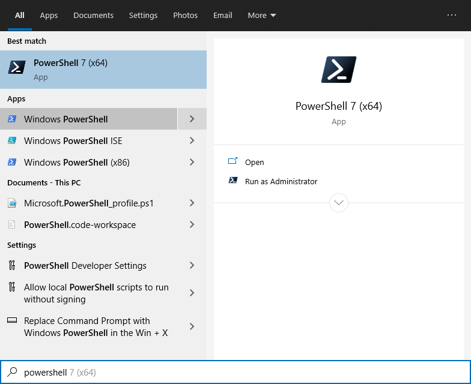
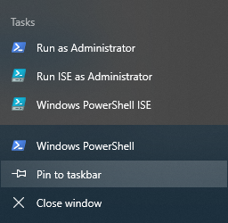
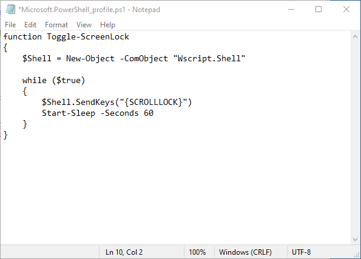
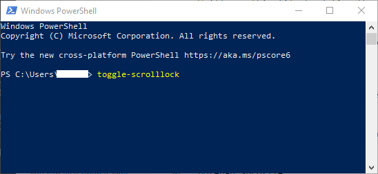

# Summary

Create a PowerShell function that will toggle the `Scroll Lock` key on and off every minute, thus preventing the computer from sleeping and making it appear to chat applications (e.g. Microsoft Teams) that you are actively using your computer.

## Start PowerShell

Press the Windows key, then type "powershell" (without the quotes).  You should see something like this:



Use the arrow keys to move the cursor to the item labeled "Windows PowerShell", then press the `Enter` key.

You may want to take this opportunity to "pin" the application to the taskbar:



## Create a "profile" file

A profile file is use to configure the environment when PowerShell starts.  We'll use this file to define the function that will toggle the `Scroll Lock` key on and off every minute.

When PowerShell opens, type the following at the `PS >` prompt to create a profile file:

```powershell
New-Item –Path $Profile –Type File –Force
```

Then type this to open the file in Notepad:

```powershell
notepad $profile
```


## Define the function

The `Toggle-ScrollLock` function will perform the action of changing the state of the `Scroll Lock` key every 60 seconds.

Do the following:

- Use your mouse to highlight everything from the word 'function' to the last '}'

```powershell
function Toggle-ScrollLock
{
    $Shell = New-Object -ComObject "Wscript.Shell"

    while ($true)
    {
        $Shell.SendKeys("{SCROLLLOCK}")
        Start-Sleep -Seconds 60
    }
}
```
- press `ctrl` + `c` to copy the text
- switch to notepad
- press `ctrl` + `v` to paste the function into your profile file

It should resemble:



- save and close the file

## Usage

To use the function, close PowerShell and open it again.  This will load the profile file and make the `Toggle-ScreenLock` function available for our usage.

To start the function, type `Toggle-ScrollLock` at the `PS >` prompt and press `Enter`:



No messages are display while the function is running.  You'll need to keep the window open for the function to operate.  You may minimize the window if desired.

To stop the function, press `ctrl` + `c` or close the PowerShell application.
